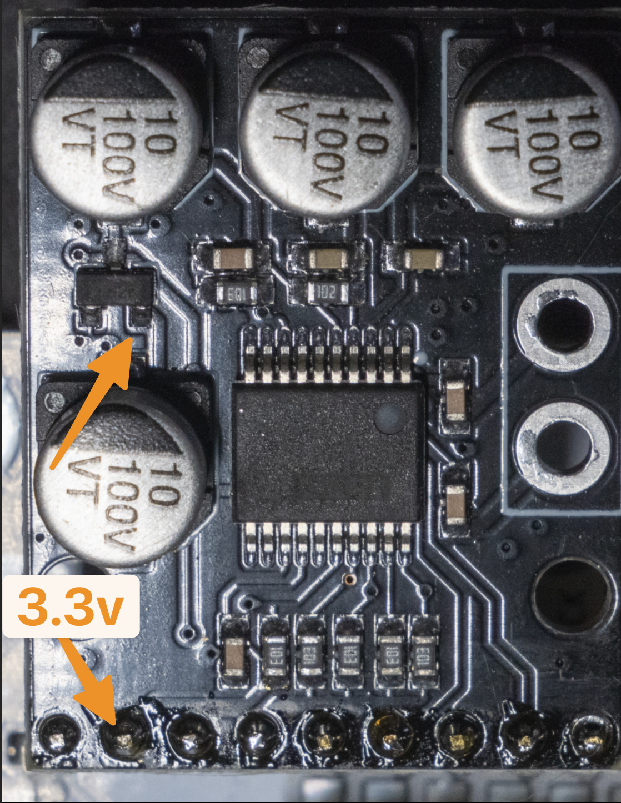

# This repo includes:

[ADC gain setup and module modification](initial_setup_and_modification/README.md) - a complete guide for gain setup and
other improvements of AD9226 module

[Pico 2 firmware](rp2350_firmware/stock_firmware.uf2) - ready to flash .uf2 firmware

[Pico 2 clipping LED firmware](rp2350_firmware/clipping_led_firmware.uf2) - ready to flash .uf2 firmware with Power LED
ADC Clipping indicator

[Case](case/README.md) - .stl files for printable case

[Graphical app for this hardware _the one and only_ **MISRC-GUI**](https://github.com/harrypm/MISRC-GUI/releases) -
download and install the Windows release here.

# High level steps to get up and running

> [!NOTE]  
> This guide assumes a basic understanding of the concepts, hardware & software options and usage of the VHS decode's
> capture method

[Otherwise, it's best to start here](https://github.com/oyvindln/vhs-decode/wiki)

<!-- TOC -->

* [1. Build a single channel AD9226 + PCM1802](#1-build-a-single-channel-ad9226--pcm1802---1-rf-video-channel--2-channel-audio)
    * [PCM1802 module defect fixes](#pcm1802-module-defect-fixes-)
* [2. Modify the AD9226/AD8138 Module](#2-modify-the-ad9226ad8138-module)
* [2. Flash the Pico 2](#2-flash-the-pico-2)
* [3. Install the driver & MISRC GUI](#3-install-the-driver--misrc-gui)
* [4. Connect, test & capture](#4-connect-test--capture)

<!-- TOC -->

### 1. Build a single channel AD9226 + PCM1802 - 1 RF (video) channel + 2 channel audio

Credits
to [Sev5000](https://github.com/Sev5000) - [Detailed board build, PCB Gerber files for manufacturer and components needed](https://github.com/Sev5000/Pico2_12bitADC_PCMAudio)
 
This Capture devce uses a USB 3.0 HDMI capture stick based on the MacroSilicon MS2130/MS2130S as an interface to tranfer
and capture
the Analogue-to-digital converter stream to PC or MAC.

I recommended following Sev's excellent parts list and approach - choose build your own or JCLPCB do all of the work.

**Bill of material:**

  

  - 1x [This](https://github.com/Sev5000/Pico2_12bitADC_PCMAudio/blob/main/Gerber_Pico2_12bitADC.zip) PCB (Send the
    Gerber[README.md](initial_setup_and_modification/README.md)
    .zip to JLC, PCBWay, ..)
  - 1x Raspberry Pi Pico 2
  - 1x [AD9226](https://aliexpress.com/item/1005003038271519.html)
  - 1x [PCM1802](https://aliexpress.com/item/1005006412873984.html) - take note below - important!
  - 2x [RCA-105 or RCA-106](https://aliexpress.com/item/1005006152724809.html)
  - 1x [PJ-324M 5P](https://aliexpress.com/item/1005006146950431.html)
  - 1x 3pin 2.54mm pin header horizontal for the headswitch/overflow selection jumper
  - 1x 9pin 2.54mm pin-socket header
  - 1x 2x10pin 2.54mm pin-socket header
  - 1x 3pin 2.54mm pin header (remove the center pin for connecting R/L of the PCM1802)
  - 1x 3pin 2.54mm pin-socket header (remove the center pin for connecting R/L of the PCM1802)

**No surface mount component variant**

  

  - 1x DVI-Sock - This ready to use HDMI board, no component soldering is necessary.
    To obtain, order the adafruit DVI sock or Aliexpress have these
  - 2x 15pin 2.54mm pin-socket header

**Or build-your-own HDMI Surface Mount Variant**:

  

- 1× Stewart SS-53000-001 connector (See [BOM](https://github.com/Wren6991/Pico-DVI-Sock#bill-of-materials) for details)
- 8× 0402 270 ohm resistors
- 5x 0805 100nF ceramic capacitors
- 2x 20pin 2.54mm pin-socket header (For socketed Pi Pico 2 only)

**Additional items needed:**

  

- HDMI cable
- MS2130/MS2130S USB 3 capture device
- VCR w/head tap mod
- VCR Head tap
- SMA or BNC 50ohm Coax cable (for connection to VCR head tap amplifier and this capture board
- RCA-to-RCA Stereo audio cable, of at least 0.5m length
- Optional: 10MHz Low pass filter and for less hassle with Amp gain setting & adjustment - one (Digital) attenuator with
  attenuation steps
  of at least -5db, -15db, -20db
- 1x [DVI-Sock](https://github.com/Wren6991/Pico-DVI-Sock) for a flush fit with the pcb edge, otherwise the adafruit DVI
  sock works fine too
- 2x 15pin 2.54mm pin-socket header

#### PCM1802 module defect fixes ####

> [!CAUTION]
> There are 2 known PCM1802 defects

**Defect 1**: the PCM1802 board needs MODE0 connected to 3.3V with a wire (those boards have a design error)

> [!NOTE]
> How to know: if your module measures 3.3v at the 3.3v header pin, this is your module

**Defect 2**: the PCM1802 board needs MODE0 connected to 3.3V with a wire (see flaw 1 image) *AND* the 3.3v supply
restored by adding a jumper wire (image below)

> [!NOTE]
> How to know: if your module measures 0v at the 3.3v header pin, this is your module

### 2. Modify the AD9226/AD8138 Module

Refer to the [guide](initial_setup_and_modification/README.md) in this repo.

Recommend full modification - or - modify for gain & VHS-Decode ready, is your choice.

### 2. Flash the Pico 2

- [Pico 2 HSDAOH firmware with clipping indicator](rp2350_firmware/clipping_led_firmware.uf2) (uses the built-in PI PICO
  2 Power LED)

### 3. Install the driver & MISRC GUI

- Install MS2130 Driver - Zadig included in release with instruction readme
- Use the [ready to install release](https://github.com/machcnz/HSDAOH-MISRC-GUI) of HSDAOH or build and install

### 4. Connect, test & capture

