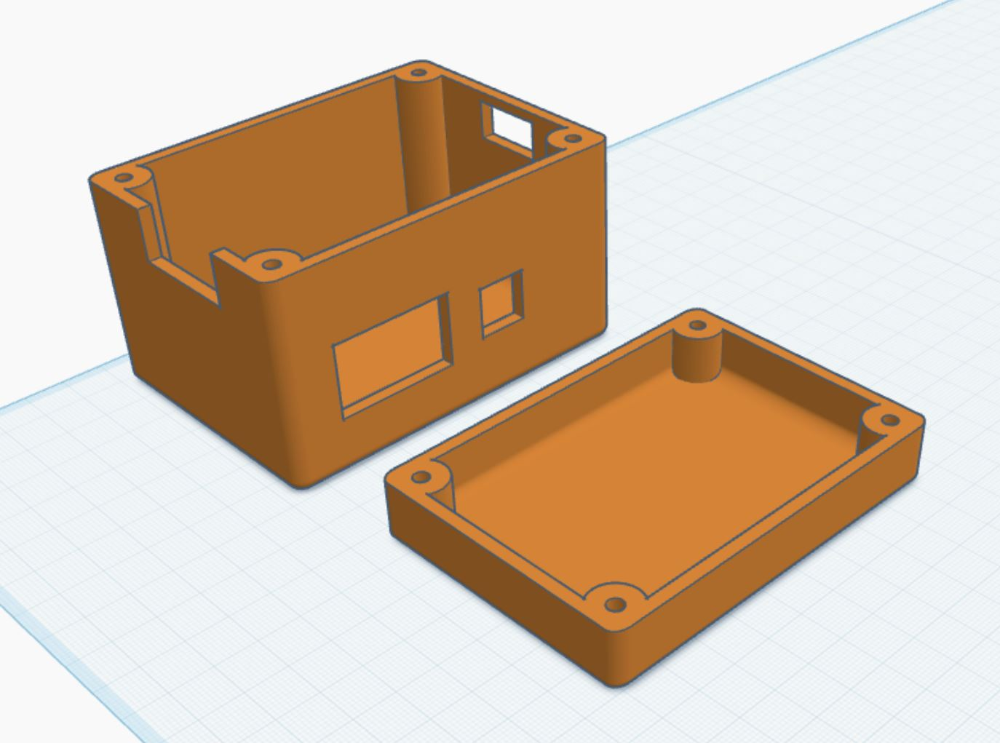
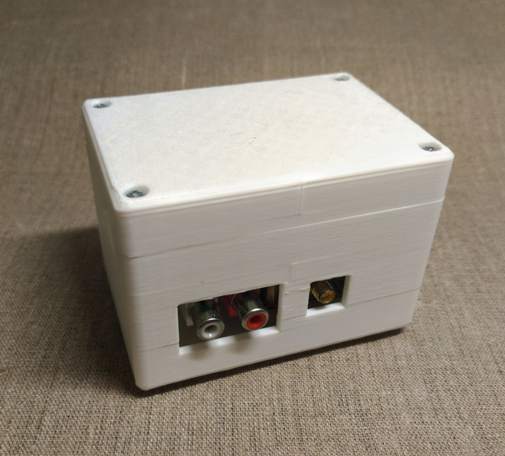

# Printable case

3D-printable enclosure for the single-channel AD9226-based HSDAOH grabber (Pico 2 + modules).

Dimensions (W × H × D): 96 × 67 × 68 mm

## What it fits

- Single-channel carrier (Pico 2 + AD9226 path)
- Typical RCA / jack / HDMI sock layout used with this build
- **Not dimensioned for dual-ADC** or unrelated boards

## Parts to print

| File | Role |
|------|------|
| `HSDAOH_case_base.stl` | Base |
| `HSDAOH_case_lid.stl` | Lid |

Source files are in [`case/`](../case/).

## Hardware

- M3 screws (length depends on lid boss + insert depth; start with 6–10 mm and check clearance)
- Heat-set inserts, **4.6 mm** OD class, for **~4.0 mm** printed holes
- Optional: short cable strain-relief / rubber feet

## Photos

## Design credit / edits

- Baseline STLs are in this repo under `case/`.
- If you remix clearances or add mount points, open a PR and note printer + material that worked.

[Back](../README.md)
