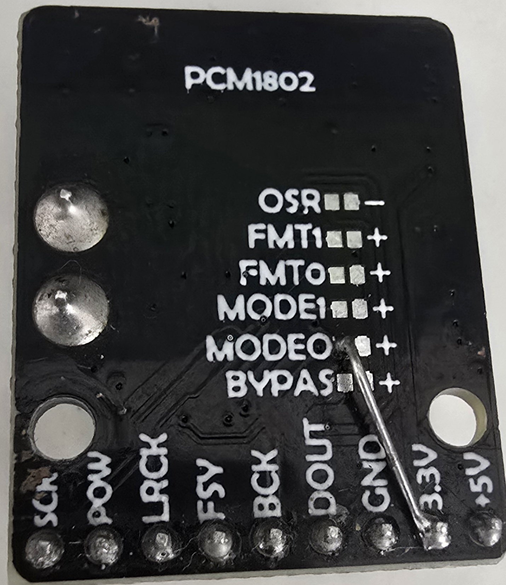
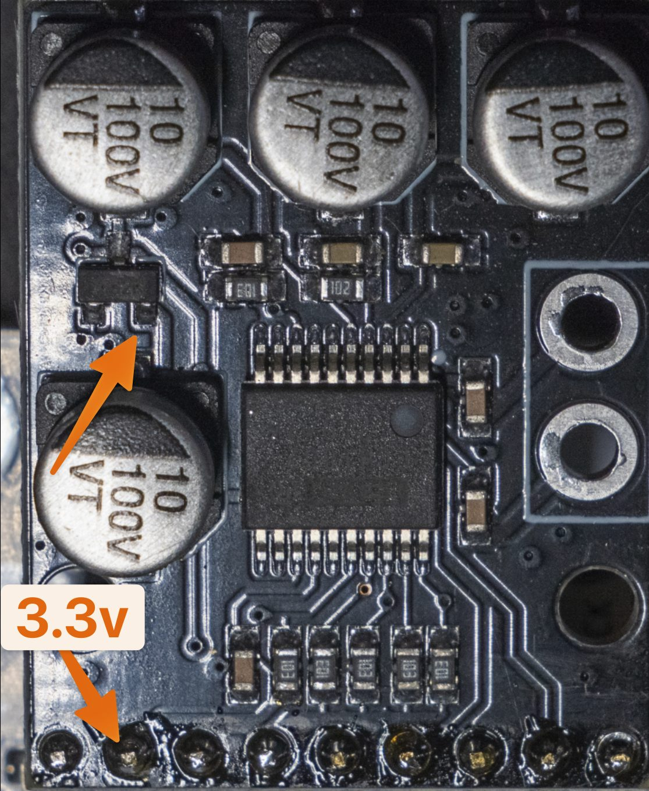

# PCM1802 module defect fixes

> [!CAUTION]
> There are 2 known PCM1802 defects

## Defect №1
The PCM1802 board needs `MODE0` connected to `3.3V` with a wire (those boards have a design error)

### Is your module defective? 

If your module measures `3.3V` at the `3.3V` header pin, it is

## Defect №2
The PCM1802 board needs `MODE0` connected to `3.3V` with a wire (see flaw 1 image) *AND* the `3.3V` supply
restored by adding a jumper wire (image below)

### Is your module defective?

If your module measures `0V` at the `3.3V` header pin, it is

